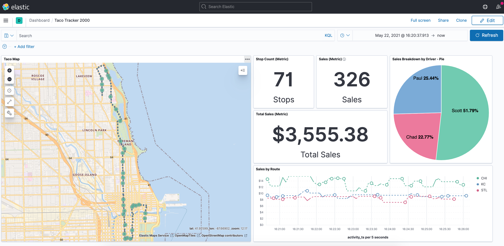
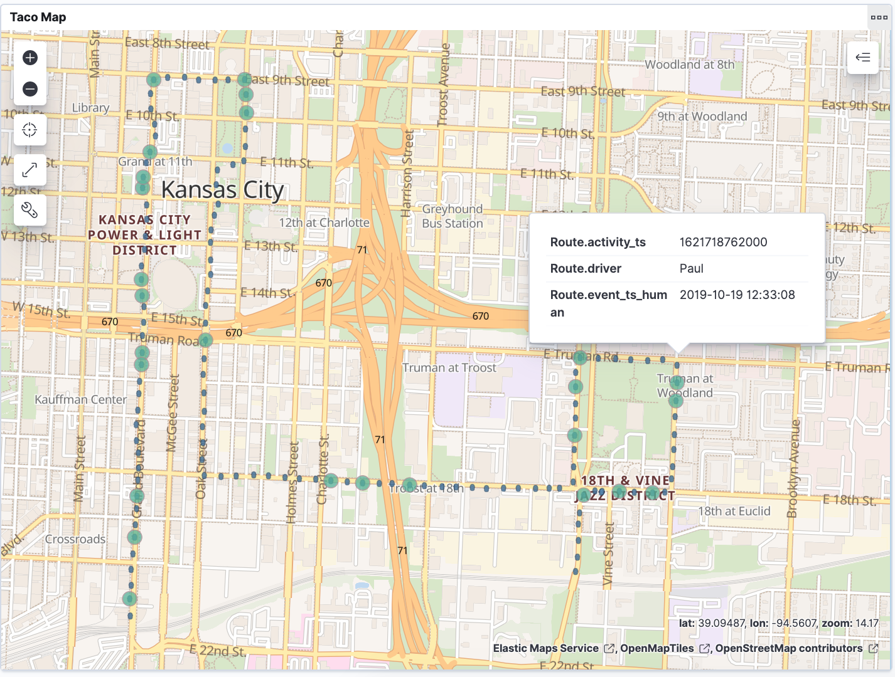
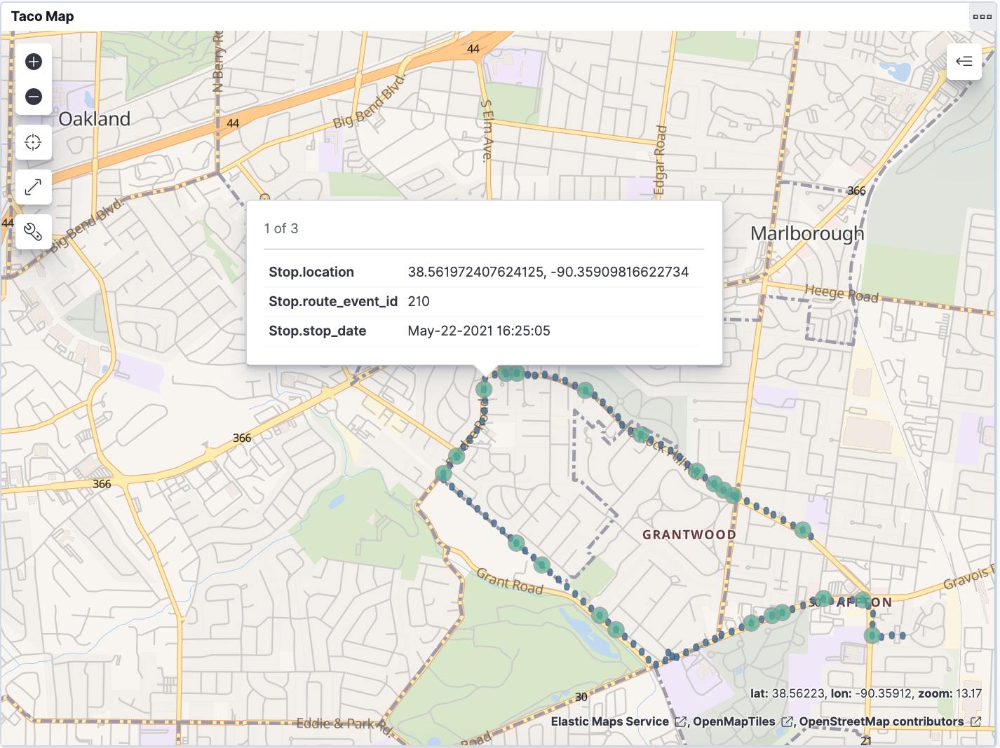
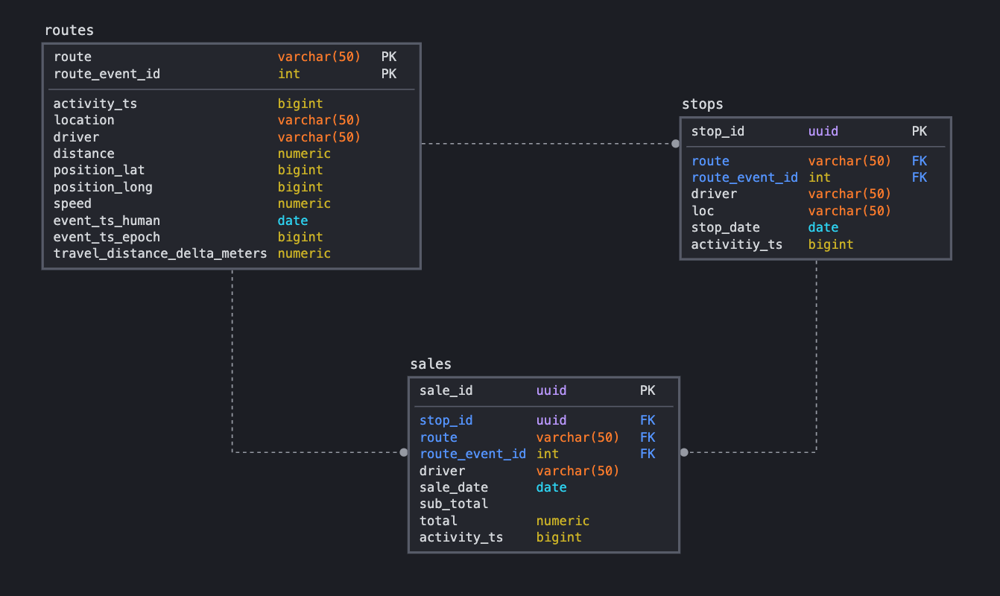

# Monster Tacos 🌮
Monster Tacos™️ is the (fictitious) revolutionary new food truck experience unlike any seen before.  It's like an ice cream truck for tacos...delivered by monster trucks.  



|||
|-|-|
|| |
## Project Overview
Monster Tacos operates in three US cities: 
Kansas City, St. Louis, and Chicago.  

This project makes use of several open source technologies including Apache Kafka, Elasticsearch, and Postgres.  

The opereational data produced is simple: 
- one lat/lon tracking event along the predefined _route_ generated from an onboard device such as an [ELD](https://en.wikipedia.org/wiki/Electronic_logging_device)
- one event per _stop_ along the **route**
- one to many _sales_ transactions per **stop** along the **route**

A simple python application is responsible for producing these events to three topics in Apache Kafka: routes, stops, and sales.  The generated events are serialized using Avro and managed using the Confluent Schema Registry.  ksqlDB is used to deploy _Kafka Connect_ sink connectors to ElasticSearch and Postgres.  Finally, Kibana is used as a tool to aggregate and visualize the metrics received in real-time from the custom dashboard, [_Taco Tracker 2000_](http://localhost:5601/app/dashboards).

Afterall, who doesn't like tacos and monster trucks?

## Tech Stack

**Applications**
- [Confluent ksqlDB](https://ksqldb.io/)
- [Confluent Schema Registry](https://docs.confluent.io/platform/current/schema-registry/index.html)

**Containerization**
- Docker
- docker-compose

**Languages**
- Python

**Serialization**
- Avro

**Storage**
- Elasticsearch
- Kafka
- Postgres

**Visualization**
- Kibana

## Data Model


## Deployment
**Start up environment**
```bash
docker-compose up -d
```
**Deploy Elasticsearch artifacts**
```bash
scripts/00-setup-elastic-local.sh
```

**Deploy Kafka Connect sink connectors**
```bash
scripts/01-setup-ksqldb-avro-local.sh
```

**Verify Connectors are running**
```bash
docker exec -it ksqldb ksql http://localhost:8088
```

```bash
OpenJDK 64-Bit Server VM warning: Option UseConcMarkSweepGC was deprecated in version 9.0 and will likely be removed in a future release.

                  ===========================================
                  =       _              _ ____  ____       =
                  =      | | _____  __ _| |  _ \| __ )      =
                  =      | |/ / __|/ _` | | | | |  _ \      =
                  =      |   <\__ \ (_| | | |_| | |_) |     =
                  =      |_|\_\___/\__, |_|____/|____/      =
                  =                   |_|                   =
                  =  Event Streaming Database purpose-built =
                  =        for stream processing apps       =
                  ===========================================

Copyright 2017-2020 Confluent Inc.

CLI v0.15.0, Server v0.15.0 located at http://localhost:8088
Server Status: RUNNING

Having trouble? Type 'help' (case-insensitive) for a rundown of how things work!

ksql> show connectors;

 Connector Name         | Type | Class                                                         | Status
-----------------------------------------------------------------------------------------------------------------------------
 SINK_ELASTIC_ROUTES_01 | SINK | io.confluent.connect.elasticsearch.ElasticsearchSinkConnector | RUNNING (1/1 tasks RUNNING)
 SINK_ELASTIC_STOPS_01  | SINK | io.confluent.connect.elasticsearch.ElasticsearchSinkConnector | RUNNING (1/1 tasks RUNNING)
 SINK_ELASTIC_SALES_01  | SINK | io.confluent.connect.elasticsearch.ElasticsearchSinkConnector | RUNNING (1/1 tasks RUNNING)
-----------------------------------------------------------------------------------------------------------------------------
```

> Note: If you notice any of the containers crashing, try increasing the amount of RAM allocated to the docker service.  I specifically had to do this in order to keep Elasticsearch up and running.


**Create Python virtual environment**
```bash
pip3 install virtualenv

python3 -m venv ./venv/monster-tacos

source ./venv/monster-tacos/bin/activate

pip3 install -r requirements.txt
```

**Deploy _Taco Tracker 2000_ Dashboard**
```bash
curl -X POST http://localhost:5601/api/saved_objects/_import?overwrite=true -H "kbn-xsrf: true" --form file=@kibana/taco-tracker-dashboard.ndjson -H 'kbn-xsrf: true'
```

## Services

|Service Name|Function|Endpoint |
|----|---|---|
|Kibana|Visualization|http://localhost:5601/app/home|
|Elasticseach|Index Store|http://localhost:9200|
|Kafka|| localhost:9092|
| | | |

## References
The [docker-compose.yml](docker-compose.yml) was modified from its original version, made by [Robin Moffatt](https://github.com/rmoff) of Confluent and may be [found here](https://github.com/confluentinc/demo-scene/blob/master/kafka-to-elasticsearch/docker-compose.yml).